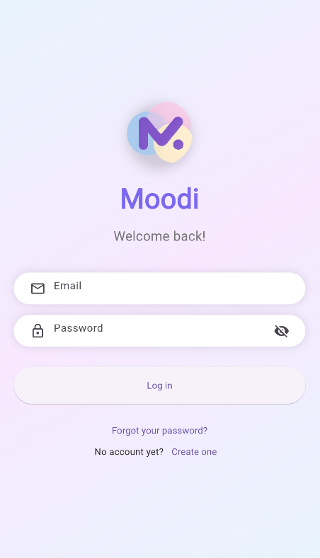
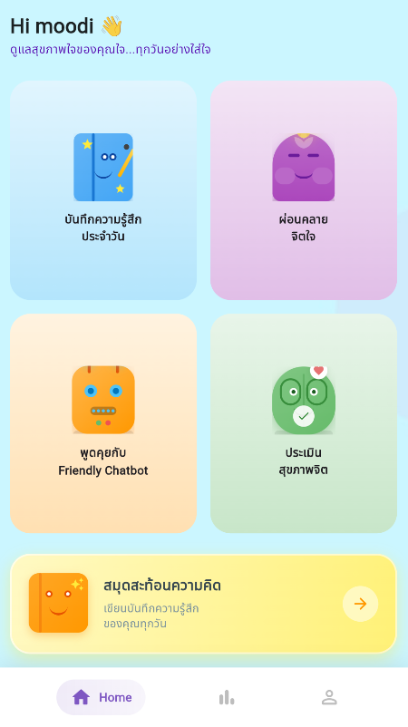
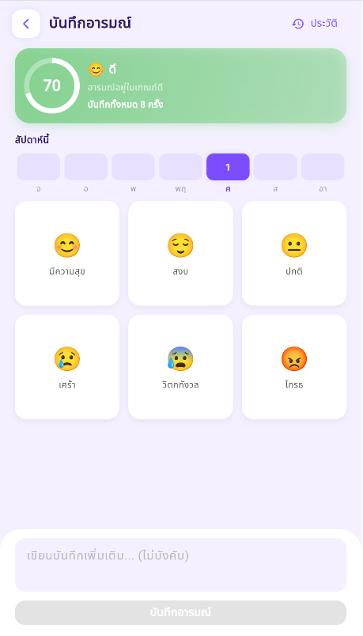
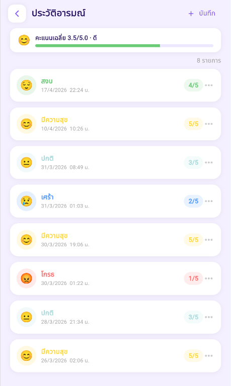
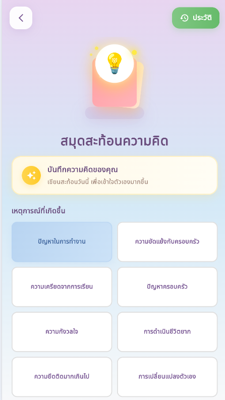
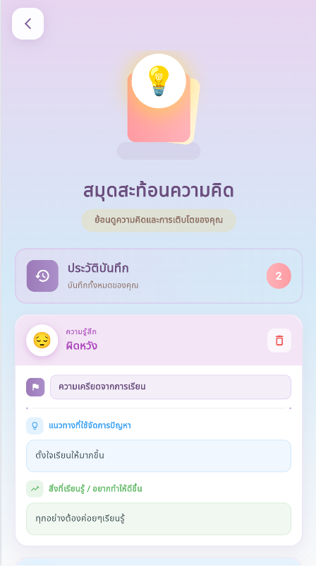
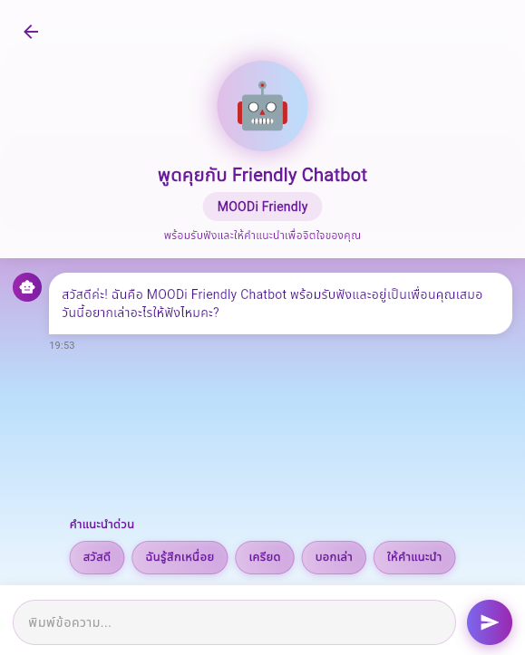
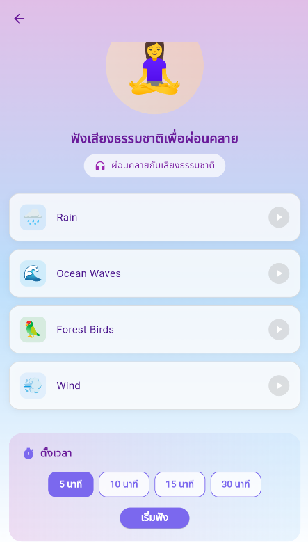
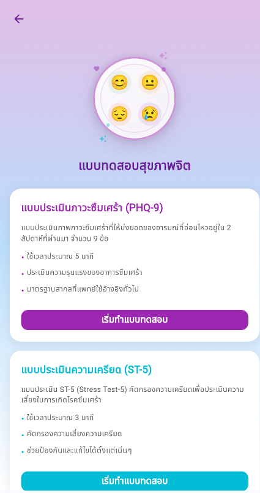
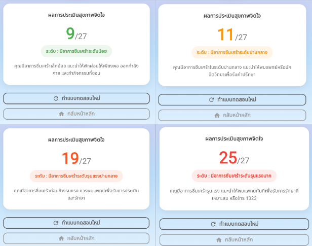

# Mental Wellness-Moodi
Senior Project: A mental wellness mobile application developed using Flutter and Firebase.

## Structure
### moodi-backend
Scalable backend service developed using Node.js, Prisma ORM, and PostgreSQL to handle authentication, mood analytics, assessment records, chatbot communication, and application data management.

### moodi-frontend
Flutter-based mobile application designed to support emotional well-being through mood tracking, self-reflection journaling, relaxation audio, mental health assessments, and chatbot interaction.

## Features
- Mood tracking and emotion recording
- Relaxing sound player for stress relief
- Friendly Chatbot for emotional support
- Depression and stress assessment tests
- Reflective journaling and self-reflection notebook

## Run Frontend
cd moodi-frontend
flutter pub get
flutter run

## Backend
Backend deployed on Railway

## Screenshots

### Authentication

| Login | Home |
|-------|------|
|  |  |

### Mood Tracking

| Mood Tracking | Mood History |
|---------------|-------------|
|  |  |

### Journaling

| Journal | Journal History |
|----------|----------------|
|  |  |

### Mental Health Support

| AI Chatbot | Relaxing Sounds |
|------------|----------------|
|  |  |

### Assessment

| Assessment | Results |
|------------|---------|
|  |  |
